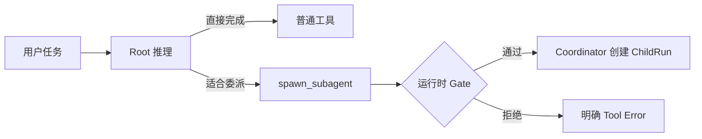

# Web Cursor 多 Agent 架构设计

> 状态：目标架构设计，尚未实现
> 更新时间：2026-07-16
> 相关路线：[roadmap.md](./roadmap.md) P0、P3、P5、P8

## 1. 背景

当前 Web Cursor 已有一个服务端 Agent loop：模型读取项目文件、调用文件工具、请求浏览器执行 `run_preview`，再根据真实运行结果继续修复。这个闭环仍以单 Agent、单次 SSE 请求和一条 Conversation transcript 为中心。

大型需求会出现三类真实瓶颈：

1. 多条互不依赖的调查或实现路径只能串行执行。
2. 搜索结果、日志和验证细节持续进入主上下文，挤占用户目标与关键约束。
3. 实现、Review、验证由同一个 Agent连续完成，缺少独立视角和明确产物边界。

多 Agent 的目标不是“同时调用多个模型”，而是建立一套完整的自治委派系统：主 Agent 判断是否委派，Coordinator 管理子 Agent 生命周期，Agent 通过明确协议共享事实和产物，用户能够实时观察、停止和检查每个 Agent 的工作。

## 2. 核心判断

### 2.1 值得实现的能力

- 主 Agent 根据任务语义自主判断是否创建子 Agent。
- 子 Agent 拥有独立上下文、角色、工具权限和生命周期。
- 多个独立子任务能够并行执行，并由主 Agent 汇聚结果。
- 子 Agent 的活动、等待、失败和结果能够实时展示并持久回放。
- 写入型 Worker 在隔离 ChangeSet 中工作，通过明确冲突协议合并。
- Root、Child 和浏览器客户端工具共享同一套可取消、可恢复的 AgentRun 协议。

### 2.2 不采用的做法

- 不用 prompt 长度、关键词或文件数量硬编码 `shouldUseSubagent`。
- 不额外调用一个分类模型替主 Agent 做相同的委派判断。
- 不让所有 Agent 共用一份实时 transcript。
- 不让模型自行提升工具权限、选择任意隔离模式或构造 workspace 身份。
- 不把 UI 活动事件全部塞回主 Agent 的模型上下文。
- 不允许多个 Worker 直接对 `project_files` 做 last-write-wins 更新。
- 不展示隐藏思维链，也不生成没有事实依据的进度百分比。

## 3. 架构决策

### D1：委派判断属于主 Agent 的工具选择

主 Agent 能看到 `spawn_subagent` 及可用 Agent 类型。当它判断任务适合委派时，调用工具；不适合时继续使用普通工具直接完成。

服务端 Delegation Policy 不重新判断任务“是否足够复杂”，只执行确定性约束：

- 调用者是否有权创建子 Agent。
- Agent 类型是否存在且允许使用。
- 最大深度、并发、时间和 token 预算是否满足。
- 目标工具权限和 workspace 隔离是否可提供。
- 请求是否符合严格 schema。

这使语义判断与安全执行各自只有一个 owner。

### D2：Agent 不共享一个上下文窗口

每个 AgentRun 拥有私有 transcript。Agent 之间共享的是：

- 创建时的有界 Context Packet。
- 绑定明确 revision 的 Workspace Snapshot。
- 通过工具按需读取的项目事实。
- 类型化 Artifact、ChangeSet 和验证结果。
- 由 Coordinator 投递的受控消息。

### D3：控制层使用 Hub-and-Spoke，执行层允许 DAG

Root 是用户意图和最终决策的 owner；Coordinator 是运行状态、依赖和消息投递的 owner。Child 默认不自由群聊，有显式依赖时才能通过 Coordinator 向目标 Agent 发消息或发布 Artifact。

大型任务可以形成 DAG：

```text
Planner
  ├── Worker A ─┐
  └── Worker B ─┼── Reviewer ── Verifier ── Root 汇总
```

### D4：模型消息流与 UI 事件流分离

Agent 的搜索、读取、等待、耗时和工具状态进入 AgentEvent：

```text
AgentEvent → 持久化 → SSE → UI
```

只有以下信息进入另一个 Agent 的模型上下文：

- 明确的问题或指令更新。
- 阶段性 Checkpoint。
- 最终 Result、Error 或 Cancelled 结果。
- 接收方主动查询的 Artifact。

### D5：代码权威来源继续是 Postgres

`project_files` 仍是已合并代码的唯一权威来源。多 Agent 不引入第二套长期真相源。

- 只读 Agent 读取绑定 revision 的 Workspace Snapshot。
- 写入型 Agent 写自己的 ChangeSet Overlay。
- Preview 运行“基础 revision + 指定 ChangeSet”。
- 合并时使用 revision/CAS；冲突必须显式暴露。

### D6：保留三执行域边界

- A 域：Root/Child LLM loop、Coordinator、持久化、服务端工具。
- B 域：Agent 活动 UI、用户控制、客户端工具调度。
- C 域：WebContainer/iframe 执行不可信代码并回传结果。

任何 Agent 都不能绕过 B/C 域把生成代码放进 Next.js 应用进程执行。

## 4. 概念模型

```text
Project ── ProjectRevision ── WorkspaceSnapshot
   │                                │
Conversation ── Root AgentRun ── Child AgentRun
                       │              ├── AgentMessage
                       │              ├── AgentEvent
                       │              ├── Artifact
                       │              └── ChangeSet
                       ├── AgentMessage
                       ├── AgentEvent
                       └── Result
```

上图是概念关系，不是数据库字段契约。具体表、字段、索引、状态枚举和迁移必须在实施前形成独立权威契约；不得根据本图猜字段或用默认值吞掉未知状态。

### 4.1 状态 owner

| 事实 | Owner |
|---|---|
| 用户目标、最终回答、是否接受子 Agent 结果 | Root AgentRun |
| 子任务 transcript、局部工具调用 | 对应 Child AgentRun |
| 生命周期、依赖、预算、取消传播 | Coordinator |
| 已合并代码和项目 revision | Workspace 服务 |
| 未合并文件变化 | 对应 ChangeSet |
| Agent 间可复用结果 | Artifact Store |
| 实时展示和历史回放 | AgentEvent Store |

## 5. 主 Agent 如何判断是否委派

### 5.1 应考虑创建子 Agent

满足以下任一语义条件时，主 Agent 可以考虑委派：

1. 任务能拆成两个以上互不依赖、可并行推进的分支。
2. 某项调查会产生大量搜索、日志或文件内容，放在 Root 上下文会造成污染。
3. 任务需要不同专业角色提供独立判断，例如架构、实现、Review、验证或安全检查。
4. 存在长时间运行的工作，等待期间仍有其他有效工作可推进。
5. 已完成 Agent 的上下文对后续同类任务仍有价值，适合恢复而不是重新调查。

### 5.2 不应创建子 Agent

1. 单文件、短步骤或 Root 能直接完成的任务。
2. 后一步严格依赖前一步结果，当前没有真实并行点。
3. 需求还需要用户做关键产品或技术选择。
4. 子任务边界、输入或期望产物不明确。
5. 写入任务尚无可用隔离环境。
6. 预计协调与上下文传递成本高于任务本身。

### 5.3 模型决策与运行时 Gate



禁止在 Gate 中重新用关键词猜测业务语义。Gate 的拒绝理由必须是可验证事实，例如深度超限、角色不存在、预算不足、隔离不可用或 schema 非法。

### 5.4 委派决策 Eval

应建立同一组正反样本，验证模型是否正确调用 `spawn_subagent`，而不是测试某个关键词 `if`。

应委派的样本：

- 同时调查前端状态、后端调用链和数据库关系。
- 按安全、正确性、测试缺口三个独立维度 Review。
- 两个独立模块可以并行实现，完成后统一验证。

不应委派的样本：

- 修改一个按钮或一处文案。
- 修复位置和原因已经明确的单文件 bug。
- 用户尚未决定关键技术选型。
- 所有步骤严格串行。

记录至少包括任务成功率、总耗时、token 成本、有效委派率、重复工作率和写入冲突率。自动委派策略只根据同一任务集的结果调整。

## 6. Agent Registry

Agent Registry 是角色和权限的权威来源。模型只选择允许的 Agent 类型，不能自行指定任意工具、模型或隔离权限。

| 角色 | 职责 | 典型能力 | Workspace 规则 |
|---|---|---|---|
| Explorer | 搜索、定位、理解代码 | list/search/read | 只读 Snapshot |
| Planner | 拆解大型需求、形成任务 DAG | read/plan | 只读 Snapshot |
| Worker | 实现一个有边界的变更 | read/write/client tool | 独立 ChangeSet |
| Reviewer | 检查 ChangeSet、风险和遗漏 | read/diff/result | 只读指定 ChangeSet |
| Verifier | typecheck/build/preview | execute/client tool | 读取指定 ChangeSet |

角色名称、工具集合、模型配置、预算和隔离策略需要从同一份 `as const`/schema 契约推导。未知角色必须失败，不映射到 general-purpose 等默认角色。

## 7. 子 Agent 创建契约

`spawn_subagent` 至少需要表达以下语义：

- 用户可见的任务标题。
- 完整且有边界的任务说明。
- 期望产物。
- Registry 中存在的 Agent 类型。
- 前台等待或后台执行意图。
- 用户可见的简短委派原因。
- 如果是恢复任务，引用权威来源中的已完成 AgentRun。

这里故意不固定字段名、enum 值和 optional/default 规则。实施前必须先定义严格 Zod schema 与错误码；所有身份、parent、project、conversation、revision 和权限由服务端上下文注入，禁止让 LLM 传入。

完整生命周期工具集目标：

- 创建子 Agent。
- 查询一个或多个任务的状态与结果，并支持有界等待。
- 取消任务。
- 向运行中 Agent 发送补充指令。
- 恢复已完成 Agent 的 transcript。

工具是否拆分、参数名和返回 schema 需在实现契约中统一决定，不能在 definition、executor 和前端分别手写。

## 8. 上下文共享

### 8.1 四类上下文

| 上下文 | 内容 | 共享方式 |
|---|---|---|
| 对话上下文 | 用户目标、已确认决策、约束 | 创建时 Context Packet + 受控消息 |
| 工作区上下文 | 文件、依赖、项目版本 | 固定 Workspace Snapshot + 按需工具读取 |
| 协作上下文 | 调查结果、计划、Diff、验证报告 | Artifact/Result 引用 |
| 运行上下文 | 状态、工具活动、耗时、等待原因 | AgentEvent，不进入普通模型消息 |

### 8.2 Context Packet

创建 ChildRun 时，Root 发送有界任务包，而不是复制整个 Conversation。任务包需要表达：

- 当前用户目标中与子任务有关的部分。
- 子 Agent 的独立目标和非目标。
- 已确认约束。
- 期望输出和验收方式。
- 相关消息、附件、Artifact 和 ChangeSet 的权威引用。
- 绑定的 workspace revision。

Context Packet 的 schema 需要单独确认。Root 如果发现信息不足，应先向用户澄清或让 Child 通过 Coordinator 请求补充，不能根据未知字段自动补全。

### 8.3 Workspace Snapshot

文件正文不复制进所有 Child Prompt。Child 通过工具按需读取绑定 revision 的 Snapshot。

同一次并行调查默认读取同一基础 revision。运行过程中项目已变化时，旧 Child 不应静默切到新版本；必须由 Coordinator 显式刷新、重启或标记结果基于旧版本。

### 8.4 Artifact Blackboard

Agent 将可复用产物发布为 Artifact，例如：

- 调查摘要。
- 实现计划或任务 DAG。
- ChangeSet。
- Review findings。
- 构建、Preview 或 Eval 结果。

其他 Agent 通过引用读取 Artifact，不把生产者完整 transcript 注入自己的上下文。Artifact 必须记录来源 AgentRun 和对应 workspace revision；过期或不匹配时显式报错。

### 8.5 Result 汇聚

Child 完成后，Root 默认只收到结构化摘要、产物引用、运行统计和明确状态。Root 需要细节时再读取 Artifact 或打开 Child transcript。

这能保留主上下文中的用户需求、约束和决策，避免被工具噪音污染。

## 9. Agent 间通信

### 9.1 默认拓扑

```text
          Root
        /  |  \
       A   B   C
```

Root/Coordinator 是默认通信中枢。Child 不直接面向用户，也不默认向所有其他 Child 广播。

### 9.2 受控消息队列

Agent 间消息通过 Coordinator 持久队列投递。消息至少要能表达以下语义：

- Root 对 Child 的新指令或约束。
- Child 向 Root 提问或提交 Checkpoint。
- 有显式依赖的 Child 之间传递问题、回答或 Artifact 引用。
- Stop、Cancel 或 Shutdown 控制信号。

具体消息类型和字段必须在实施契约中定义；未知类型不能被 normalize 成普通文本。

### 9.3 安全投递边界

消息不能插入正在进行的模型 token 流或工具 mutation 中间。Coordinator 只在安全边界投递：

```text
模型调用完成
→ 当前工具调用闭合
→ 检查 Inbox
→ 按顺序追加消息
→ 开始下一轮模型调用
```

每条消息必须具备幂等投递边界；重放不能重复注入同一条指令。

### 9.4 Child 请求用户输入

Child 不直接弹出用户问题：

```text
Child 发现缺少关键决策
→ 向 Root 提交 needs-input 语义
→ Root 检查已有上下文和其他 Agent 产物
→ 必要时 Root 统一询问用户
→ 用户回答由 Root 转发给相关 Child
```

这样可以避免多个 Agent 同时打断用户，也保持 Root 对用户意图的所有权。

## 10. 上下文共享方案比较

| 方案 | 优点 | 缺点 | 结论 |
|---|---|---|---|
| 所有 Agent 共用一份 transcript | 实现直观，信息天然可见 | 上下文污染、并发顺序不确定、权限边界消失、token 昂贵 | 不采用 |
| 创建时 Fork 完整父 transcript | 不容易漏背景，支持快速恢复 | 复制全部噪音；成本高；Fork 后仍会分叉 | 仅在短上下文或恢复同一 Agent 时使用 |
| 精简 Context Packet | 边界清晰、成本低、可审计 | Root 可能遗漏重要约束 | 默认方式 |
| 按需 Retrieval | 上下文随任务加载，适合大项目 | 检索可能漏，增加工具延迟 | 与 Context Packet 组合 |
| Shared Blackboard | 异步、可恢复、产物可复用 | 需要 schema、版本、权限和清理策略 | 用于 Artifact/ChangeSet |
| 周期性摘要同步 | 比完整 transcript 便宜 | 摘要可能失真；频繁同步仍污染 | 只用于显式 Checkpoint |

推荐组合：

```text
精简 Context Packet
+ 按需 Retrieval
+ Artifact Blackboard
+ Workspace Snapshot / ChangeSet
```

## 11. 通信拓扑比较

| 拓扑 | 优点 | 缺点 | 使用方式 |
|---|---|---|---|
| Hub-and-Spoke | 权限、停止、审计和用户体验最清楚 | Root 可能成为瓶颈 | 默认控制拓扑 |
| Point-to-Point | 动态协作快，减少 Root 转发 | 容易循环、死锁、消息爆炸和跨上下文泄漏 | 只对显式依赖开放 |
| Shared Blackboard | 解耦、异步、重启后可恢复 | 版本和垃圾治理复杂 | 共享产物，不共享随意聊天 |
| DAG/Pipeline | 依赖和并行点明确，进度最好展示 | 初始计划错误时需要重排 | 大型编码任务的执行拓扑 |
| Swarm/群聊 | 灵活，适合创意探索 | 高成本、重复工作、责任和合并困难 | 不作为默认编码模式 |

最终组合是：控制层 Hub-and-Spoke，执行层 DAG，数据层 Artifact Blackboard。

## 12. AgentRun 生命周期与 Coordinator

### 12.1 生命周期语义

AgentRun 至少需要表达：等待调度、正在运行、等待子任务、等待服务端工具、等待浏览器工具、完成、失败和取消等语义。

这里不固定最终状态枚举。状态集合、合法转移、terminal 判定、超时和恢复规则必须在实现前形成一个状态机契约；未知状态直接暴露协议错误。

### 12.2 Coordinator 职责

- 创建 Root/Child AgentRun 并建立父子关系。
- 从 Registry 解析角色、工具、模型和隔离策略。
- 执行并发、深度、时间、token 和资源预算。
- 维护任务依赖和 Inbox。
- 在安全边界投递消息。
- 处理查询、等待、停止、恢复和超时。
- 持久化 AgentEvent、Result 和错误原因。
- 把 Child Result 注入正确的 Root 工具边界。
- 保证不同 owner、project、conversation 和 parent 之间不串线。

### 12.3 取消传播

- 停止 Root 默认请求取消所有未终止后代。
- 停止单个 Child 不应自动取消 Root 或无依赖兄弟任务。
- Root 失败或会话被删除时，Coordinator 必须清理或取消仍在运行的 Child。
- 取消后不得启动新模型轮次、新工具或 mutation。
- 晚到的工具结果、Agent 消息和 SSE 事件必须明确拒绝或标记为晚到，不能恢复已取消任务。

## 13. 可观察进度与 UI

### 13.1 三层 UI

1. **主消息生命周期块**：展示 Root 创建了哪些 Agent、当前活动、耗时和终态。
2. **全局任务面板**：Active/Done 分组，支持打开、停止和发送补充指令。
3. **独立 Child Thread**：展示任务、工具时间线、Artifact、ChangeSet、验证结果和最终摘要。

示例：

```text
已启动 3 个子 Agent
├── Explorer · 调查前端状态流       正在读取 hooks/useChat.ts
├── Worker · 实现后端协调器         等待浏览器预览
└── Reviewer · 检查并发风险         已完成 · 18s
```

### 13.2 展示原则

- 展示可观察行为：工具、目标文件、等待原因、耗时、结果。
- 不展示隐藏思维链。
- 不显示模型自行编造的百分比。
- 活动文案优先由已校验工具名和参数映射生成，不直接信任自由文本。
- 原始文件内容、Prompt 和超长日志默认折叠或只提供引用。

### 13.3 事件与模型上下文隔离

UI 可以实时收到高频 AgentEvent，但 Root 模型只在 Checkpoint、问题和终态时收到消息。前端不得通过观察 React state 再“猜”一个 Agent 的状态；状态来自统一 reducer 消费的权威事件。

## 14. 浏览器客户端工具路由

`run_preview` 当前由 B/C 域执行。多 Agent 后，客户端工具调用必须绑定具体 AgentRun 和 tool call，并支持持久等待：

```text
Worker 请求 run_preview
→ AgentRun 进入等待浏览器工具的状态
→ SSE 把请求路由到浏览器
→ WebContainer 执行指定 Snapshot/ChangeSet
→ 浏览器回传结果到原 AgentRun/tool call
→ Coordinator 闭合工具调用
→ Worker 恢复
```

必须满足：

- tool result 不能只按 Conversation 归属。
- 同时存在多个 Client Tool 请求时不能串结果。
- 浏览器关闭时不得伪装成功；AgentRun 保持明确等待或按策略失败。
- 重连后可以回放未闭合请求，但 mutation 和 result 提交都必须幂等。
- Preview 结果绑定运行来源、ChangeSet 和项目 revision。

## 15. 写入隔离与合并

### 15.1 ChangeSet Overlay

写入型 Worker 从明确的基础 revision 开始，所有创建、编辑、删除和重命名进入自己的 ChangeSet，不直接修改 `project_files`。

```text
Project Revision N
├── Worker A ChangeSet
└── Worker B ChangeSet
```

### 15.2 Preview 与 Review

- Worker Preview 使用“Revision N + Worker ChangeSet”。
- Reviewer 读取同一个 ChangeSet、用户要求和验证结果。
- 需要 B 依赖 A 时，Coordinator 显式声明依赖，并把 A 的已确认 Artifact/ChangeSet 作为 B 的输入；不能让 B 偶然读到 A 的未完成写入。

### 15.3 合并协议

- 合并前比较基础 revision 与当前项目 revision。
- 无冲突时原子应用 ChangeSet 并生成新 revision。
- 有冲突时产生明确冲突结果，交给 Root、专用 Merge Agent 或用户处理。
- 禁止自动选择某一方、模糊匹配或退化为整文件覆盖。
- 撤销只反向应用该 ChangeSet，不能覆盖其后用户修改。

这相当于 Grok Build 的 worktree 隔离语义，但实现应以 Postgres revision/ChangeSet 为基础，而不是引入第二套 Git 权威来源。

## 16. 与当前代码的接缝

| 当前文件 | 现状 | 多 Agent 演进方向 |
|---|---|---|
| `app/api/chat/route.ts` | Agent loop 与 SSE 生命周期在 Route Handler 内 | 抽出通用 Agent runner，由 Coordinator 创建 Root/Child |
| `server/llm.ts` | 单一 Root system prompt 和工具集合 | Registry 按角色生成 prompt/tool profile |
| `server/tools/definitions.ts` | 只有项目工具 | 增加严格的任务生命周期工具定义 |
| `server/tools/executor.ts` | 工具上下文只有 owner/project/conversation | 工具归属升级到 AgentRun；权限由 profile 约束 |
| `types/chat.ts` | SSE 事件没有 AgentRun 身份 | 引入可严格解析、可关联、可回放的 AgentEvent |
| `hooks/useChat.ts` | 单请求、单 AI 消息、全局活动文案 | 聊天状态与 AgentRun reducer 分离 |
| `lib/types.ts` / `AiBubble.tsx` | 已有消息 Timeline 扩展点 | 增加 Agent 生命周期块和 Child Thread 入口 |
| `server/db/schema.ts` | Conversation/Message 和 ImageRun，无通用 AgentRun | 在权威数据契约确认后增加 Run/Event/Artifact/ChangeSet 持久化 |
| `app/api/conversations/[id]/tool-results` | Client Tool Result 按会话闭合 | 升级为 Run/tool-call 级严格归属和幂等提交 |

## 17. 完整目标的实施顺序

这是一套目标架构按依赖落地，不是一次性 Demo 或会被丢弃的简化版。

### 阶段 1：Delegation Policy 与 Agent Registry

- 定义 Root 的委派规则和正反 Eval。
- 定义 Registry、角色能力和权限来源。
- 定义严格的 spawn/query/cancel/steer/resume 工具契约。
- 重构单 Agent runner，使 Root/Child 能复用同一运行内核。

### 阶段 2：持久 AgentRun 与 Coordinator

- 定义并实现生命周期状态机。
- 持久父子关系、消息、事件和结果。
- 实现深度、并发、预算、等待、取消和恢复。
- 保持现有单 Agent 行为向后兼容。

### 阶段 3：AgentEvent 与进度 UI

- SSE 多路复用 Root/Child 事件。
- 引入 AgentRun reducer。
- 实现主消息生命周期块、任务面板和 Child Thread。
- 支持刷新回放、单独停止和补充指令。

### 阶段 4：浏览器工具多路路由

- Client Tool Request/Result 绑定 AgentRun。
- 支持多个等待中的 Child。
- 支持断线、重连、幂等和明确等待状态。

### 阶段 5：Revision、ChangeSet 与写入型 Worker

- Project revision/CAS。
- 隔离 ChangeSet Overlay。
- Overlay Preview、Review 和合并冲突协议。
- Worker、Reviewer、Verifier 任务 DAG。

### 阶段 6：Eval、成本与调度优化

- 在同一任务集比较单 Agent 与多 Agent。
- 调整并发、模型、预算和主动委派策略。
- 识别重复工作、无效委派、上下文遗漏和合并冲突。
- 只有数据证明必要时再增加高级检索、P2P 协作或持久后端 workspace。

## 18. 关键验收场景

### 委派判断

- 大型、可并行任务会创建边界清晰的 Child；简单任务不创建。
- 每次委派都有用户可见原因和期望产物。
- 未知角色、非法参数、深度或预算超限返回明确错误。

### 上下文隔离

- Child 只能读取当前 parent/project 授权的 Context、Artifact 和 Snapshot。
- Child transcript 不自动进入 Conversation 或兄弟 Agent。
- Child 结果明确记录基于哪个 revision。

### 通信

- 消息只在安全边界投递一次。
- 一个 Child 不能未经依赖授权向任意兄弟广播。
- Child 请求用户输入时只由 Root 统一发问。

### 取消与恢复

- 停止 Root 后，所有未终止后代不再开始模型轮次、工具或 mutation。
- 停止一个 Child 不影响无依赖兄弟任务。
- 刷新后可以看到真实状态和已完成事件，不重复执行 mutation。

### 写入与验证

- 两个 Worker 的未合并修改互不可见。
- Preview 结果不会提交给错误的 ChildRun。
- 基础 revision 变化时合并明确失败，不静默覆盖。
- Reviewer 看到的是指定 ChangeSet 和真实验证结果。

## 19. 风险与权衡

| 风险 | 影响 | 缓解 |
|---|---|---|
| 自动委派过多 | token 与延迟上升 | 正反 Eval、预算 Gate、记录有效委派率 |
| Context Packet 遗漏约束 | Child 结论偏离 | 明确输出契约、消息引用、Child 可请求补充 |
| Root 成为瓶颈 | 汇聚和转发变慢 | DAG、Artifact 引用、有界 P2P |
| 高频事件污染 DB/UI | 存储与渲染压力 | 事件分级、合并活动、限制 payload，不污染模型上下文 |
| Agent 消息循环 | 成本失控或死锁 | 深度/消息预算、依赖 ACL、循环检测、超时 |
| 并行写冲突 | 用户代码被覆盖 | revision/CAS、ChangeSet Overlay、显式 merge |
| 浏览器不在线 | Client Tool 无法完成 | 持久等待、重连或明确失败，不伪装成功 |
| Provider 限流 | 子 Agent 大量失败 | 并发 Gate、退避、预算与运行统计 |

## 20. 实施前仍需明确的产品决策

以下内容不能靠实现时猜测：

1. 哪些角色首批可用，以及每个角色的权威工具集合。
2. 自动委派是否需要用户批准；读、写和高成本任务是否采用不同策略。
3. 最大深度、并发、运行时长、token 与消息预算。
4. AgentRun、AgentEvent、AgentMessage、Artifact 和 ChangeSet 的严格 schema。
5. 生命周期状态机、合法转移、错误码和恢复规则。
6. Child Thread 的保留期限和用户删除行为。
7. 写入型 Worker 的合并由 Root 自动执行、Reviewer Gate 还是用户批准。
8. 浏览器离线时 Client Tool 的等待时限和终止策略。
9. 不同角色是否使用不同模型，以及成本展示方式。

这些决策确认后，才能进入对应实现；不写兼容未知字段、未知 enum 或静默兜底逻辑。

## 21. 外部参考

- [Grok Build：Subagents and Personas](https://github.com/xai-org/grok-build/blob/main/crates/codegen/xai-grok-pager/docs/user-guide/16-subagents.md)
- [Grok Build：Task/Subagent tool types](https://github.com/xai-org/grok-build/blob/main/crates/common/xai-tool-types/src/task.rs)
- [Grok Build：Subagent request handling](https://github.com/xai-org/grok-build/blob/main/crates/codegen/xai-grok-shell/src/agent/subagent/handle_request.rs)
- [Grok Build：Coordinator query and lifecycle](https://github.com/xai-org/grok-build/blob/main/crates/codegen/xai-grok-shell/src/agent/subagent/coordinator_query.rs)
- [Grok Build：Background tasks](https://github.com/xai-org/grok-build/blob/main/crates/codegen/xai-grok-pager/docs/user-guide/20-background-tasks.md)
- [Codex：Subagents](https://learn.chatgpt.com/docs/agent-configuration/subagents)

借鉴的是独立 session、Coordinator、任务生命周期、权限和可观察 UI；不照搬 Rust/TUI、Git worktree 或宽松字段兼容。Web Cursor 的实现必须服从 Postgres 权威代码源、浏览器 WebContainer 和严格 schema 约束。
