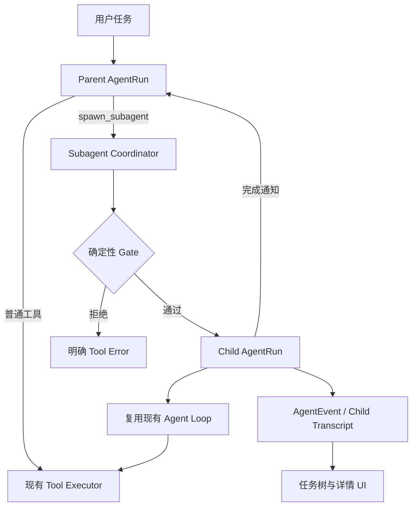

# Web Cursor 通用 Sub-agent Runtime 架构

> 状态：目标架构，尚未实现
>
> 更新时间：2026-08-11
>
> 研究对象：OpenAI Codex、xAI Grok Build、Claude Code 的官方源码或官方文档
>
> 本文只定义架构职责与实施不变量。数据库字段、API 字段和状态枚举必须在编码阶段依据现有契约单独确认，禁止从示意图猜 schema。

## 1. 结论

Web Cursor 不应分别实现 Explorer、Planner、Worker 三套系统。

正确的基础能力是：

```text
主 Agent 判断任务是否适合委派
  → 调用通用 spawn_subagent 工具
  → Coordinator 校验限制并创建独立 Child AgentRun
  → Child 复用同一套 Agent loop，在自己的上下文和权限内工作
  → 结构化进度持续展示给用户
  → Child 结果自动投递给 Parent
  → Parent 决定继续委派、整合结果或直接完成
```

Explorer、Planner、Worker、Reviewer 都只是 `Agent Profile`：它们为同一套 Runtime 提供不同的提示、工具权限、默认上下文策略和执行限制。

## 2. 上游实现事实

### 2.1 Codex

Codex 暴露的是通用 `spawn_agent`，不是 `spawn_explorer` 或 `spawn_planner`。主 Agent 根据工具说明决定是否调用；工具说明强调只委派边界清晰、能够独立推进的任务。

Child 是一条独立 Thread。创建时可配置角色、模型和上下文继承方式；当前实现支持不继承、继承完整历史或继承最近 N 轮。运行时负责清理不能直接复制到 Child 的上下文项。

协作能力独立于创建能力，包括发送消息、追加后续任务、查询状态、等待、打断和关闭。Child 完成后，控制层会把结果通知 Parent。

Codex 把协作动作记录成结构化 `collabToolCall`，并持久化 Parent–Child Thread 关系，客户端可查询直接 Child 或全部后代。

来源：

- [multi-agent 工具定义](https://github.com/openai/codex/blob/main/codex-rs/core/src/tools/handlers/multi_agents_spec.rs)
- [spawn 实现](https://github.com/openai/codex/blob/main/codex-rs/core/src/tools/handlers/multi_agents/spawn.rs)
- [AgentControl 与通信](https://github.com/openai/codex/blob/main/codex-rs/core/src/agent/control.rs)
- [Child Thread 创建与上下文 fork](https://github.com/openai/codex/blob/main/codex-rs/core/src/agent/control/spawn.rs)
- [App Server 事件与 Thread 关系](https://github.com/openai/codex/blob/main/codex-rs/app-server/README.md)

### 2.2 Grok Build

Grok Build 的模型侧同样使用通用 `task/spawn_subagent`。`general-purpose`、`explore`、`plan` 是 Agent 类型配置，不是独立调度系统。

其运行链路是：

```text
TaskTool
  → SubagentRequest
  → 单写者 SubagentCoordinator
  → ChildRunner
  → 独立 Child Session
```

请求可携带 Agent 类型、能力模式、隔离方式、后台执行、模型覆盖和恢复来源。普通模型任务默认启动独立上下文；内部 Runtime 仍支持 new、forked、resumed 三种上下文来源。

写入型 Child 可进入独立 Git worktree。界面通过 `SubagentSpawned`、`SubagentProgress`、`SubagentFinished` 等事件展示状态、耗时、当前活动和完整 Child transcript。

来源：

- [Subagents 用户文档](https://github.com/xai-org/grok-build/blob/main/crates/codegen/xai-grok-pager/docs/user-guide/16-subagents.md)
- [TaskTool](https://github.com/xai-org/grok-build/blob/main/crates/codegen/xai-grok-tools/src/implementations/grok_build/task/mod.rs)
- [SubagentRequest](https://github.com/xai-org/grok-build/blob/main/crates/codegen/xai-grok-tools/src/implementations/grok_build/task/types.rs)
- [SubagentCoordinator](https://github.com/xai-org/grok-build/blob/main/crates/codegen/xai-grok-tools/src/implementations/grok_build/task/coordinator.rs)
- [Child Runtime](https://github.com/xai-org/grok-build/blob/main/crates/codegen/xai-grok-shell/src/agent/subagent/handle_request.rs)

### 2.3 Claude Code

Claude Code 也由主模型调用通用 Agent 工具。自定义 Agent 定义自己的提示、工具和权限；默认使用独立上下文，必要时可以 fork。官方建议把会产生大量日志、搜索结果或文件内容的独立任务交给 Sub-agent。

来源：

- [Create custom subagents](https://code.claude.com/docs/en/sub-agents)
- [Run agents in parallel](https://code.claude.com/docs/en/agents)

## 3. 架构原则

### 3.1 语义决策属于主 Agent

是否委派是模型的工具选择，不是服务端分类问题。

禁止新增：

```ts
shouldUseSubagent(userMessage)
```

也不额外调用一个分类模型做同样的判断。

主 Agent 根据任务、当前进展和 `spawn_subagent` 的工具说明自主选择：

- 直接使用普通工具完成；
- 创建一个 Child；
- 创建多个互不依赖的 Child；
- 继续使用已经创建的 Child。

### 3.2 Coordinator 只做确定性控制

Coordinator 不判断任务“够不够复杂”。它只检查可验证事实：

- 调用者是否允许创建 Child；
- Agent Profile 是否存在；
- 最大深度和并发是否超限；
- token、时间和工具轮次预算是否可用；
- 请求的工具能力是否允许；
- 写入隔离是否可用；
- Parent 和 Child 是否属于同一 Project/Conversation/运行树；
- 请求是否满足严格 schema。

任何未知类型、状态或字段都必须明确失败，不能映射到默认角色。

### 3.3 Child 是完整 AgentRun

Child 不是一次额外 LLM completion，也不是一个只返回搜索摘要的函数。

它必须拥有：

- 独立 AgentRun 身份；
- 独立 transcript；
- 独立模型循环和工具调用记录；
- 自己的上下文压缩；
- 工具权限；
- 生命周期和停止能力；
- Parent–Child 关系；
- 用户可查看的结果与运行记录。

Child 应复用现有 Agent loop 和 AgentRun 状态机。不能复制一份简化循环，否则停止、恢复、工具账本和压缩会产生两套语义。

### 3.4 Profile 是配置，不是 Runtime

概念上的 Profile：

| Profile | 主要职责 | 典型能力 |
|---|---|---|
| general-purpose | 通用独立任务 | 由调用上下文和 policy 决定 |
| explorer | 搜索、定位、理解代码 | 搜索、读取、有限执行 |
| planner | 形成实施计划和任务拆分 | 搜索、读取、计划输出 |
| worker | 实现边界明确的代码变更 | 搜索、读取、写入、执行 |
| reviewer | 独立检查变更 | 读取、diff、验证结果 |

这张表不是当前 enum 契约。首次实现前必须建立唯一的 Profile Registry，再从它推导 schema、提示和权限；不能在工具定义、执行器和 UI 中分别手写。

## 4. 核心组件


```mermaid
flowchart TD
    U["用户任务"] --> P["Parent AgentRun"]
    P -->|"普通工具"| T["现有 Tool Executor"]
    P -->|"spawn_subagent"| C["Subagent Coordinator"]
    C --> G{"确定性 Gate"}
    G -->|"拒绝"| E["明确 Tool Error"]
    G -->|"通过"| R["Child AgentRun"]
    R --> L["复用现有 Agent Loop"]
    L --> T
    R --> V["AgentEvent / Child Transcript"]
    V --> UI["任务树与详情 UI"]
    R -->|"完成通知"| P
```

### 4.1 `spawn_subagent` 工具

工具需要表达以下语义，但本文不提前固定字段名：

- 用户可理解的任务名称；
- 完整、独立、有边界的任务说明；
- Agent Profile；
- 上下文策略；
- 前台等待或后台执行；
- 能力限制；
- 工作区隔离策略；
- 可选预算覆盖；
- 可选恢复来源。

身份类字段不应由模型填写：Parent Run、Project、Conversation、Owner、Repository 等必须由服务端执行上下文注入。

### 4.2 `SubagentCoordinator`

Coordinator 是一棵 AgentRun 树的单一生命周期 owner，负责：

- 创建 Child；
- 记录 Parent–Child 边；
- 并发、深度和预算准入；
- 查询和等待；
- 消息投递；
- 停止和取消传播；
- 完成结果投递；
- 防止晚到结果重新激活已停止任务。

Coordinator 不执行 LLM 推理，也不直接修改项目文件。

### 4.3 Agent Profile Registry

Registry 是 Profile 的权威来源，至少决定：

- system/developer instruction overlay；
- 允许的工具集合；
- 默认上下文策略；
- 默认预算；
- 是否允许继续 spawn；
- 是否需要写入隔离。

权限计算应取交集：Child 的最终能力不能超过 Parent、服务器 policy 和 Profile 三者共同允许的范围。

### 4.4 Child Runner

Child Runner 负责把已通过准入的配置转成现有 AgentRun：

```text
Agent Runtime
+ Child 身份
+ 上下文来源
+ Profile overlay
+ 工具 policy
+ workspace/repository 绑定
+ 预算
= Child AgentRun
```

它必须复用现有 transcript assembler、harness identity、tool invocation ledger、Stop fence、lease 和 context checkpoint。

## 5. 上下文策略

上游没有统一默认值，因此 Web Cursor 必须显式建模，不能把某一种经验写成绝对规则。

目标语义：

| 模式 | Child 初始可见内容 | 适用场景 |
|---|---|---|
| fresh | 系统规则、Profile、委派任务、工作区引用 | 独立调查、上下文隔离 |
| recent turns | fresh + 最近 N 个完整对话轮次 | 需要近期决策但不需要全部历史 |
| full fork | 清理后的 Parent 模型上下文 | 高度依赖完整讨论的任务 |
| resume | 已完成 Child 的 transcript + 新任务 | 延续同一专业任务 |

关键规则：

1. 上下文继承单位必须是可证明完整的 turn，不能按字符串或字节截断。
2. fork 必须清理 Parent 专属运行提示、未闭合工具调用和不应复制的内部消息。
3. Child 必须重新装配当前系统规则、Profile 和工具定义。
4. resume 必须验证来源 Child 的 Project、Conversation、Profile 和终态。
5. ContextCheckpoint 用于压缩和恢复，不等同于 Parent–Child 关系。
6. 文件正文不需要全部塞进 prompt；Child 可通过现有项目工具按需读取。

第一轮实现可以只开放一种经过确认的模式，但协议和 Runtime 不能写成 Explorer 专用。

## 6. Agent 通信

通信是通用控制面能力，不依赖具体 Profile。

目标能力：

- Parent 向 Child 追加信息；
- Parent 给已空闲 Child 分配后续任务；
- Child 向 Parent 返回阶段结果或请求补充；
- 有明确需要时允许 Agent 间定向消息；
- 查询一个或多个 Child；
- 等待任一或全部结果；
- 打断当前 turn；
- 停止 Child 及其后代；
- 恢复已完成或已关闭 Child。

消息必须通过 Coordinator 持久投递，在模型调用或工具调用的安全边界生效，不能插入正在流式生成的 token 中间。

Child 的完成结果应自动通知 Parent；Parent 不应通过无限轮询才能知道 Child 已结束。

## 7. 工作区与写入隔离

只读 Profile 不需要单独的 Runtime，但写入型 Child 必须解决冲突。

上游做法：

- Grok Build 可使用独立 Git worktree；
- Codex 的协作指导要求并行写任务拥有不重叠的文件范围，并由控制层管理 Child Thread。

Web Cursor 不能直接照搬本地 Git worktree，因为项目可能使用 Database 或 BrowserGit Repository。正确要求是：

1. Child 绑定明确的 Repository 和基础版本；
2. 并行写入不能无条件覆盖同一最新状态；
3. 合并前必须能识别基础版本变化和文件冲突；
4. 冲突必须暴露给 Parent 或用户，不能静默 last-write-wins；
5. 两种 Repository 的隔离契约需分别设计，不能猜测它们能力相同。

在写入隔离完成前，可以用只读任务验证通用 Runtime，但这只是 canary，不是最终架构。

## 8. 生命周期与停止

Parent 和 Child 都是 AgentRun，因此沿用现有终态、lease、attempt、tool invocation 和 Stop fence。

必须额外定义的传播规则：

- 停止一个 Child：取消它当前 turn，并按明确策略处理其后代；
- 停止 Parent 当前 turn：是否同时停止本 turn 创建的 Child，必须形成产品契约；
- 停止整个任务树：所有未终态 Child 都进入取消流程；
- Child 完成后释放并发槽，但 transcript 和结果仍可查看；
- 已取消 Child 的晚到模型或工具结果不得改变项目或 Parent 状态；
- Parent 已终态时，Child 结果只能持久化，不能偷偷重新启动 Parent。

向后兼容策略不能在实现时自行决定。若需要给现有 `agent_runs` 增加关系或身份字段，必须先确认旧 Run 的读取和迁移方式。

## 9. 用户如何看到进度

UI 不展示隐藏思维链，也不伪造百分比。

用户可见的是结构化事实：

```text
Parent 正在工作
├── Explorer：搜索路由与数据流 · 运行中
│   └── 当前活动：读取 app/api/chat/route.ts
├── Planner：形成实施计划 · 已完成
└── Worker：等待 Planner 结果 · 等待中
```

最低事件语义：

- Child 创建开始、成功或失败；
- Child turn 开始、完成、失败或取消；
- 工具调用开始和结束；
- 等待、压缩、重试、需要输入；
- Agent 消息或结果已投递；
- Child 终态与耗时。

事件流和模型上下文分离：

```text
AgentEvent → 持久化 → SSE/查询 → UI
```

只有任务、明确消息、阶段结果和最终结果进入另一个 Agent 的模型上下文。UI 活动日志不应全部回填给 Parent。

## 10. 主 Agent 的委派指导

`spawn_subagent` 工具说明应引导模型在以下情况考虑委派：

- 存在可并行的独立调查或实现分支；
- 某项工作会产生大量搜索、日志或文件内容；
- 需要独立 Review 或验证视角；
- 长任务运行时 Parent 仍有其他有效工作；
- 已有 Child 上下文适合继续复用。

以下情况通常应继续本地完成：

- 小而明确的单点修改；
- 下一步严格依赖该子任务，Parent 只能原地等待；
- 子任务边界和期望输出不清楚；
- 用户尚未决定关键产品或兼容策略；
- 协调成本明显高于任务成本。

这些是模型提示和 Eval 样本，不是服务端 `if/else`。

## 11. 实施顺序

完整架构不等于一次上线所有能力。按端到端切片推进，但每一层都围绕通用 Runtime：

1. 定义通用 Profile、spawn 和 Parent–Child 契约。
2. 把现有 Agent loop 提取为可被 Parent/Child 共用的 Runner。
3. 实现 Coordinator 的创建、限制、查询、完成通知和停止。
4. 接入一种明确的上下文策略，跑通一个真实 Child AgentRun。
5. 持久化 Child transcript、Parent–Child 关系和结构化事件。
6. 在前端展示任务树、状态、当前工具和结果详情。
7. 增加消息、follow-up、wait、interrupt、resume。
8. 增加其他上下文模式。
9. 设计 Database 与 BrowserGit 的写入隔离，再开放 Worker。
10. 用同一组任务比较单 Agent 与多 Agent 的成功率、耗时、token 和冲突率。

第一轮验收可以使用 Explorer 或 Planner，但验收对象必须是“通用 Child AgentRun 能否工作”，而不是“有没有实现一个只读 Explorer 功能”。

## 12. 当前项目的复用点

Web Cursor 已有以下地基：

- `server/agentRuns.ts`：持久 AgentRun、lease、Stop fence、tool invocation ledger；
- `types/agentRun.ts`：严格状态和 API 契约；
- `app/api/chat/route.ts`：当前 Agent loop 与 SSE；
- `lib/agent/fullContextAssembler.ts`：严格 transcript 装配；
- `server/contextCheckpoint.ts`：上下文压缩与恢复材料；
- `server/agentHarness.ts`：Harness identity 与恢复校验；
- `server/tools/definitions.ts`、`server/tools/executor.ts`：工具定义和执行入口；
- Client Tool 与 Preview 闭环：B/C 域执行和结果回填。

当前真正缺少的是：

- Parent–Child AgentRun 契约；
- 通用 Profile Registry；
- 可复用 Agent Runner；
- Subagent Coordinator；
- Agent 间消息与完成通知；
- 任务树事件与 UI；
- 并行写入隔离。

因此下一步不是继续补 Memory，也不是先写一个 Explorer 专用接口，而是先把“现有单 Agent loop 能否以 Child AgentRun 身份再次运行”打通。
